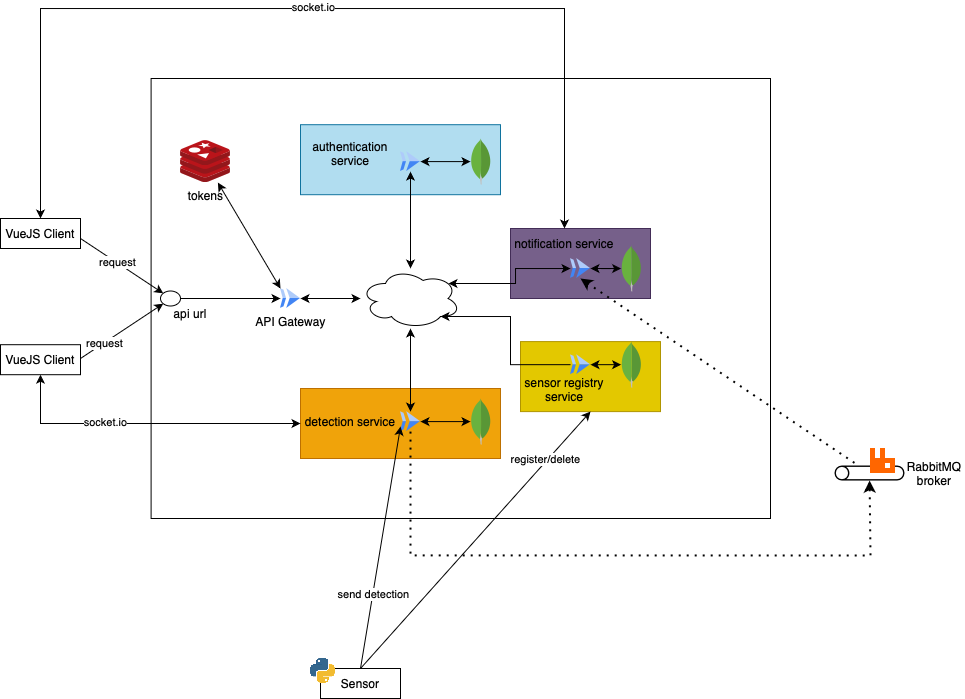

## Continuous Deployment (Backend)

This is the pipeline that is responsible for deploying automatically all our
services into github and in the cloud. For the latter, the workflow in manually
dispatched, in this way it is possible to have a better control over the entire
process.

### Semantic Release on GitHub

Following conventional commits, we can leverage `semantic-release` in order
to automatically trigger new releases of the whole backend monorepo on github
(and in future versions, on NPM, see more in [future works](./6-conclusions.md)).
More in particular, the usage of commit analyser let us to trigger:
- a major version when including `BREAKING CHANGE` in commit message;
- a minor version when including `feat` at the beginning of a commit;
- a patch version when including `fix` at the beginning of a commit.

A version is then triggered with the following workflow:
```yaml
release:
    needs: [lint-and-test]
    runs-on: ubuntu-latest
    if: ${{ success() }}
    steps:
      - name: Checkout
        uses: actions/checkout@v4

      - name: Setup node
        uses: actions/setup-node@v4
        with:
          node-version: '23.10.0'

      - name: install deps
        run: npm i

      - name: run semantic-release
        run: npm i && npx semantic-release
        env:
          GITHUB_TOKEN: ${{ secrets.GITHUB_TOKEN }}
```

which triggers the actual release if QA tests passes (task `lint-and-test`) on
GitHub releases section, including a changelog with all release information.

### Continuous Deployment on GitHub Pages

A second job downloads the uploaded bundle and pushes it to the `gh-pages` branch using [`peaceiris/actions-gh-pages`](https://github.com/peaceiris/actions-gh-pages).

```yaml
jobs:
  deploy:
    needs: build
    if: github.ref == 'refs/heads/main' && github.event_name == 'push'
    runs-on: ubuntu-latest
    steps:
      - uses: actions/download-artifact@v4
        with:
          name: ${{ needs.build.outputs.artifact-name }}
          path: ./dist

      - uses: peaceiris/actions-gh-pages@v4
        with:
          personal_token: ${{ secrets.GH_PAGES_TOKEN }}
          publish_dir: ./dist
```

### Google Cloud

Before deploying our images, we first needed to choose a cloud provider. After evaluating the available options, we narrowed our decision down to two main contenders, each with distinct advantages:

1. Azure – The Alma Mater Studiorum offers a $100 credit for use with Azure.
2. Google Cloud Platform (GCP) – Known for its ease of use, speed, extensive library support, strong community and documentation, and a wide range of services.

Considering these benefits, we ultimately chose Google Cloud Platform. Among the many services GCP offers, we utilized only the ones essential for our deployment: Google Cloud Artifact Registry and Google Cloud Run.

#### Google Cloud Artifact Registry

The *Google Cloud Artifact Registry* is a repository where it is possible to store *Docker* images. All the images that we build, must be tagged with a specific ID, and pushed inside the *Registry*. All this can be achieved by using the standard *docker build* command, here a snippet of our command: 

```bash
docker build --push -t {GCP-REGION}-docker.pkg.dev/{GCP-PROJECT}/{name-of-repository}/{tag-of-the-image} .
```

By default the last image that is pushed inside the *Registry* is labelled as *latest*, in this way the deploy is far more easy, because the deploy will always take the latest image pushed.

#### Google Cloud Run

It is a *Google* service that enables the automatic deployment of container images stored in a *Google Cloud Archive*. This service also supports automatic scaling—dynamically adjusting the number of instances based on incoming request traffic—allowing seamless handling of varying workloads. To deploy an image, a specific Google Cloud command is used:

```bash
gcloud run deploy {SERVICE-NAME}--image {Docker-TAG} --project {GCP-PROJECT} --region {GCP-REGION} --port {PORT}
```

In this way we are able to deploy our instances into the cloud and make it available to the internet.

### Workflow for deploying the services

This is the final step for deploying all our services into the cloud. We achieved this goal by creating a specific *github action* for this task. The action is called "Deploy on Google Cloud Platform" and it is divided into multiple steps:
1. Checkout of the current repository;
2. Clone the cloud utility *service-builder*;
3. Install the *service-builder's* python version;
4. Install UV and sync all the *service-builder* dependencies;
5. Install the Google Cloud SDK and run the authentication for Google Cloud;
6. Set up Docker and Docker buildx;
7. Login to Google Cloud Artifact;
8. Install and setup NodeJS;
9. Build all the Docker Images and deploy them on Google Cloud Run.

By executing all this steps, it is possible to deploy all the images on the cloud. It is important to say that this workflow in triggered manually. The main reason for that is because it is a really costly operation and doing that every time that a push is made on the *main* branch can result is a higher invoice.

The final architecture deployed on Google Cloud is the following:



---

<div style="display: flex; justify-content: space-between; align-items: center; font-size: 0.9em;">
  <a href="/er-climate-monitor/4-devops.html">&laquo; Previous</a>
  <a href="/er-climate-monitor/index.html" style="text-align: center;">Home</a>
  <a href="/er-climate-monitor/6-conclusions.html">Next &raquo;</a>
</div>
